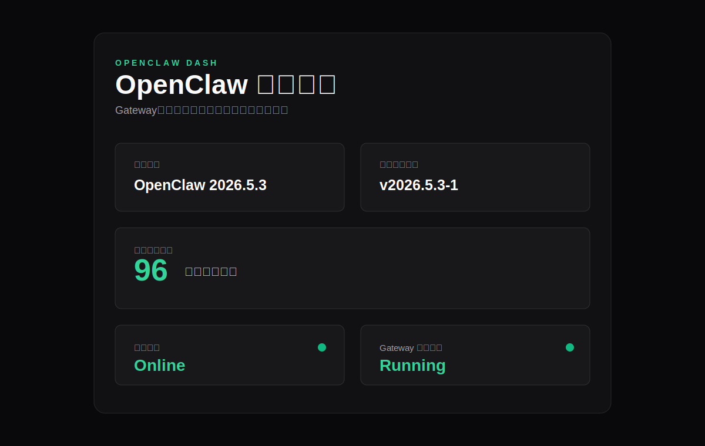
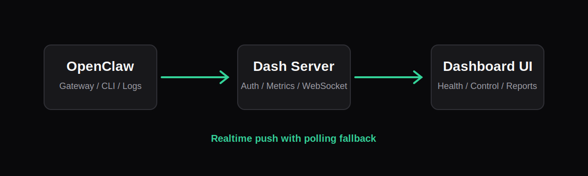

# OpenClaw Dash — Community Diagnostic Toolkit

A lightweight local diagnostic toolkit for the OpenClaw community. Open the dashboard, export a privacy-masked report, paste it in Discord or your support group, and others can see the facts immediately.



## Use Cases

- **“My OpenClaw is broken, can someone help?”** — open the dashboard, export a redacted diagnostic report or support bundle, and paste it into the community without manually describing versions, configs, or logs
- **Preflight before updating** — check disk space, CLI compatibility, channel status, and Gateway state before upgrading
- **Quick health checks** — review health score, Gateway uptime, Feishu/Telegram status, and recent errors at a glance
- **Read-only config inspection** — inspect channel enablement, allowlists, `blockStreaming`, and related config health without editing files

## Features

- Local version and upstream version monitoring with GitHub, npm, and dashboard cache fallback.
- Gateway start, restart, stop, and update workflow with step-by-step progress.
- Dynamic channel diagnostics using OpenClaw CLI probes, logs, and direct API checks where supported.
- Compatibility self-check for the OpenClaw CLI commands the dashboard depends on.
- Update preflight checks for version diff, disk space, CLI compatibility, Gateway state, and channel probes.
- Channel stats, recent errors, operation audit log, and fault timeline.
- Dynamic channel grid for Feishu, Telegram, Email, and future OpenClaw channels discovered from config/probe output.
- Official OpenClaw Control UI companion card for reachability, auth presence, safe open links, and support-report context.
- Troubleshooting path suggestions that decide whether to use OpenClaw Dash, the official Control UI, channel verification, or a redacted support bundle.
- Channel trust labels that distinguish direct verification, OpenClaw CLI probes, log inference, and config-only status.
- WebSocket realtime push for Gateway and channel state, with polling as a fallback.
- Memory and disk monitoring for macOS.
- Read-only configuration health view for channel enablement, allowlist counts, and `blockStreaming`.
- Log noise muting for known harmless lines such as `bot open_id resolved: unknown`.
- High-resolution long screenshot export with automatic masking for common private identifiers.
- First-run wizard for OpenClaw CLI, Gateway, log paths, config readability, token, LaunchAgent, and access mode.
- Health score and daily summary across Gateway, channels, version, disk, and recent errors.
- Partial Markdown report export for diagnostics, version, channel, resource, and redacted error summaries.
- Support bundle export (`.tar.gz`) with report, environment, metrics, diagnostics, compatibility, config health, and redacted errors.



## Requirements

- macOS
- Node.js 18 or newer
- OpenClaw CLI installed and available at `~/.npm-global/bin/openclaw` or in PATH
- OpenClaw configured locally under `~/.openclaw`

## Project Status

This is a macOS-first local operations dashboard. It is suitable for personal OpenClaw Gateway management and is being hardened toward broader community use.

Current guardrails:

- CI smoke test on GitHub Actions.
- Server syntax check and frontend inline-script parse check.
- Security smoke check that blocks shell-string `exec()` usage.
- Command execution uses `execFile` or `spawn` with argument arrays where system tools are needed.
- Frontend runtime assets are served locally from `public/assets` and `public/vendor`.
- Semistandard linting runs in CI.
- Endpoint smoke tests run against a mocked local OpenClaw CLI fixture.

Known engineering work still planned:

- Make OpenClaw binary path discovery configurable across more install locations.
- Keep Linux/Windows support out of scope until OpenClaw Gateway operations are validated there.

Tested locally with OpenClaw `2026.5.3` on macOS. The dashboard includes `/api/compatibility` to check whether the installed OpenClaw CLI exposes the commands and JSON fields it depends on.

## Quick Start

**One-line install (macOS):**

```bash
curl -fsSL https://raw.githubusercontent.com/Micar2024/openclaw-dash/main/install.sh | bash
```

After installation, open `http://127.0.0.1:3000`. The first-run wizard walks you through the setup checks.

The installer checks Node.js, downloads or updates the source, installs dependencies, builds local frontend assets, and registers the macOS LaunchAgent. It does not overwrite local changes; if `~/openclaw-dash` is not a git repository, it backs it up before installing.

**Manual install:**

```bash
git clone https://github.com/Micar2024/openclaw-dash.git
cd openclaw-dash
npm install
npm start
```

Then open `http://127.0.0.1:3000`.

**Install as a macOS login item (after manual install):**

```bash
bash scripts/install-macos.sh
```

This installs dependencies, builds frontend assets, writes the LaunchAgent, and starts the service.

(The one-line installer already includes this step.)

**Need help?** Open the dashboard, click **Export Report** or **Export Bundle**, and paste the redacted output into the community. Reports and bundles include versions, Gateway status, channel health, system resources, recent errors, and recommendations.

## Diagnostic Principles

OpenClaw Dash is not a replacement for OpenClaw, and it is not a heavyweight monitoring platform. Its main job is to produce a standardized diagnostic report that the community can understand quickly.

Data sources are layered by reliability:

- **Layer 1: local facts** — Gateway processes, log files, disk, memory, macOS, and Node.js. These do not depend on Gateway being healthy.
- **Layer 2: basic OpenClaw CLI** — `openclaw --version`, `openclaw doctor`, and related commands for version and compatibility context.
- **Layer 3: OpenClaw JSON/probe capabilities** — channel probes, model runtime, and other enhanced signals. Failures do not block report generation.

Even when Gateway is down, the dashboard should still export a useful partial report: missing process, last log time, recent errors, system state, read-only config health, and version clues. Markdown reports use per-section fault tolerance, so one broken data source does not stop the whole report.

## Relationship With The Official Dashboard

The official OpenClaw Dashboard / Control UI is the Gateway-native operation surface for chat, official settings, Gateway-native management, and WebSocket connections. OpenClaw Dash does not replace it and does not read or store official tokens.

OpenClaw Dash complements it through diagnostics:

- Check whether the official Control UI is reachable and provide a safe open link
- Show official Gateway auth presence in read-only form (present/absent only, never secret values)
- Record official UI reachability, HTTP status, and troubleshooting hints in reports and support bundles
- When the official UI is unavailable, still generate reports from local processes, logs, config, and system resources

In short: the official Control UI operates OpenClaw; OpenClaw Dash explains the problem clearly.

## Configuration

Optional environment variables:

```bash
DASHBOARD_HOST=127.0.0.1
DASHBOARD_PORT=3000
OPENCLAW_GATEWAY_PORT=18789
DASHBOARD_TOKEN=your-token
OPENCLAW_DASH_FEISHU_APP_ID=your-feishu-app-id
OPENCLAW_DASH_FEISHU_APP_SECRET=your-feishu-app-secret
```

If `DASHBOARD_TOKEN` is not provided, the app creates a local fallback token at:

```text
~/.openclaw/dash-token
```

Runtime files are stored under `~/.openclaw`:

- `dash-audit.log`
- `dash-update-job.json`
- `dash-version-cache.json`
- `dash-log-muted-rules.json`

These files are intentionally not part of the repository.

Feishu direct diagnostics prefer `OPENCLAW_DASH_FEISHU_APP_ID` and `OPENCLAW_DASH_FEISHU_APP_SECRET` when present. If they are not set, the dashboard falls back to the local OpenClaw config and known credential-file shapes for compatibility, but it reports the credential source without exposing secret values. Supported credential fields are:

```json
{
  "appSecret": "string",
  "app_secret": "string",
  "lark": { "appSecret": "string", "app_secret": "string" },
  "feishu": { "appSecret": "string", "app_secret": "string" }
}
```

## macOS LaunchAgent

The recommended path is the installer:

```bash
./scripts/install-macos.sh
```

Manual LaunchAgent setup is also possible. Adjust paths if your project lives somewhere else.

```xml
<?xml version="1.0" encoding="UTF-8"?>
<!DOCTYPE plist PUBLIC "-//Apple//DTD PLIST 1.0//EN"
  "http://www.apple.com/DTDs/PropertyList-1.0.dtd">
<plist version="1.0">
<dict>
  <key>Label</key>
  <string>com.openclaw.dashboard</string>
  <key>ProgramArguments</key>
  <array>
    <string>/Users/YOUR_USER/openclaw-dash/scripts/start-dashboard.sh</string>
  </array>
  <key>RunAtLoad</key>
  <true/>
  <key>KeepAlive</key>
  <true/>
  <key>StandardOutPath</key>
  <string>/Users/YOUR_USER/openclaw-dash/logs/dashboard.out.log</string>
  <key>StandardErrorPath</key>
  <string>/Users/YOUR_USER/openclaw-dash/logs/dashboard.err.log</string>
</dict>
</plist>
```

Install it:

```bash
mkdir -p ~/Library/LaunchAgents ~/openclaw-dash/logs
cp com.openclaw.dashboard.plist ~/Library/LaunchAgents/
launchctl bootstrap gui/$(id -u) ~/Library/LaunchAgents/com.openclaw.dashboard.plist
launchctl kickstart -k gui/$(id -u)/com.openclaw.dashboard
```

## Troubleshooting

### Gateway fails to start

1. Run `openclaw --version` in Terminal to confirm the CLI works
2. Check whether port 18789 is already in use: `lsof -i :18789`
3. Check `~/.openclaw/openclaw.json` for syntax issues: `openclaw doctor`
4. Export a diagnostic report from the dashboard and ask for help in [OpenClaw Discord](https://discord.com/invite/clawd)

### Feishu/Telegram appears offline

1. Wait 5 minutes; Gateway reconnection has a buffer period
2. Confirm network access: `curl -I https://open.feishu.cn`
3. Restart Gateway from the dashboard control panel
4. If Feishu stays offline, check whether the appSecret has expired
5. Export a diagnostic report and check whether Recent Errors contains Feishu/Telegram entries

### Health score stays low

- Confirm all channels are online
- Check Recent Errors for accumulated failures
- Run diagnostics from the Health Diagnostics panel
- Export a screenshot (automatically redacted) and ask the community for help

### Dashboard behaves unexpectedly after updating

- Dashboard startup logs live at `~/openclaw-dash/logs/dashboard.err.log`
- Confirm Node.js is version 18 or newer: `node -v`
- Reinstall with `curl -fsSL https://raw.githubusercontent.com/Micar2024/openclaw-dash/main/install.sh | bash`; it updates automatically

## Safety Notes

- The dashboard is designed for local use and binds to `127.0.0.1` by default.
- Setting `DASHBOARD_HOST=0.0.0.0` enables LAN access. Only do this on a trusted network, and keep `~/.openclaw/dash-token` private.
- It does not edit OpenClaw configuration files.
- Control actions are limited to OpenClaw Gateway operations and update orchestration.
- Channel "real verification" sends a test message only after explicit confirmation.
- Screenshot export masks common private identifiers in the exported copy.

Authentication design:

- All `/api/*` routes require authentication except `/api/auth/*`.
- Local browser access from `127.0.0.1` can create an HttpOnly session cookie through `/api/auth/local-login`.
- Remote access requires a bearer token. If `DASHBOARD_TOKEN` is not set, a random token is generated at `~/.openclaw/dash-token` with file mode `0600`.
- Session cookies are HMAC-SHA256 signed with the dashboard token and checked with `crypto.timingSafeEqual`.
- Operations are appended to `~/.openclaw/dash-audit.log`.

Screenshot and Markdown report export mask these patterns in the exported copy:

- Feishu/OpenClaw IDs beginning with `ou_` or `cli_`.
- Long numeric identifiers.
- IPv4 addresses.
- `PID: <number>` values.
- Local `/Users/...` filesystem paths.
- Common token/secret strings, email addresses, and Telegram-style bot tokens.

## Development

```bash
npm test
npm run lint
npm run build:assets
npm run check
npm start
```

The server is organized as a route aggregator plus focused support modules under `src/server/`:

- `config.js` for paths, ports, and runtime constants.
- `runtime.js` for filesystem and system-command helpers.
- `processes.js` for process/memory display helpers.
- `realtime.js` for WebSocket state streaming.
- `auth-service.js` for token/session auth, local login, API guard middleware, and audit entries.
- `gateway-service.js` for Gateway process detection, control commands, and watchdog alerts.
- `channel-service.js` for channel health inference, message stats, real verification, and channel watchdog alerts.
- `version-service.js` for local/upstream version checks and version source health.
- `diagnostics-service.js` for model detection, OpenClaw probes, compatibility checks, Feishu direct diagnostics, and config health.
- `metrics-service.js` for Gateway, channel, disk, memory, process, model, and version metrics aggregation.
- `official-dashboard-service.js` for official Control UI reachability and auth-presence diagnostics.
- `update-service.js` for update job persistence, preflight checks, update steps, doctor, restart, and post-update diagnostics.
- `reports.js` for Markdown report rendering.
- `timeline.js` for fault timeline aggregation.
- `routes/auth.js` for authentication endpoints.
- `routes/gateway.js` for Gateway status and control endpoints.
- `routes/channels.js` for channel status and real probe endpoints.
- `routes/metrics.js` for dashboard metrics.
- `routes/updates.js` for update and preflight endpoints.
- `routes/diagnostics.js` for diagnostics, model, compatibility, and config health endpoints.
- `routes/logs.js` for audit, timeline, errors, and log mute rules.
- `routes/product.js` for setup and health summary endpoints.
- `routes/reports.js` for export endpoints.
- `routes/version.js` for local/upstream version and version source endpoints.

## Releases

The package version starts at `v1.0.0`. Pushing a `v*` tag runs the release workflow, executes lint/tests, and publishes a source archive on GitHub Releases:

```bash
git tag v1.0.0
git push origin v1.0.0
```

## License

MIT
